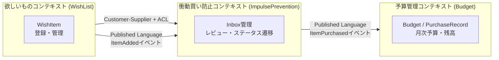

## このbookについて

個人開発アプリ「ホシカ」を題材に、DDD（ドメイン駆動設計）とClean Architectureを実践した過程をまとめる。

ホシカは「欲しいものリスト × 予算管理」のアプリで、**自由に使えるお金の中で、何を・いつ・どの順番で買うかを決める**のを助けるものだ。

このプロジェクトの真の目的は「動くものを作る」ではなく、**DDD + Clean Architectureを体得すること**。変更容易性を担保した設計を習得することを最優先にしている。

---

## 章の構成

| 章 | 内容 |
|---|---|
| 第1章 | はじめに（本章） |
| 第2章 | DDDとClean Architectureはそれぞれ何を解決するのか |
| 第3章 | ユビキタス言語をゼロから設計する |
| 第4章 | エンティティと値オブジェクトの違いをPriceで理解する |
| 第5章 | 衝動買い防止のドメインルールをどう設計したか |
| 第6章 | バウンデッドコンテキストとコンテキストマップの設計 |

---

## プロジェクト概要

### 技術スタック

- **Backend**: Rust（Axum + SQLx）
- **Frontend**: React + TypeScript（Vite）
- **DB**: PostgreSQL
- **Infra**: Fly.io
- **Architecture**: DDD + Clean Architecture

### 設計の基本方針

DDDとClean Architectureはそれぞれ異なる問題を解決する。

| | 問いかけ | 解決する問題 |
|---|---|---|
| **DDD** | 何をモデリングするか | ビジネスとコードの言語乖離 |
| **Clean Architecture** | どう層を分けるか | 外部依存によるビジネスロジックの汚染 |

依存の方向は常に内側（Domain層）へ向かう。Domain層はフレームワークを知らない。

```
Presentation（Axum handlers）
      ↓
Application（Use Cases）
      ↓
Domain（Entities / Value Objects / Repository traits）
      ↑
Infrastructure（SQLx / 外部API）
```

---

## ドメインモデルの全体像

### エンティティ

| 用語 | 日本語 | 所属コンテキスト |
|------|--------|----------------|
| `WishItem` | 欲しいもの | WishList |
| `Budget` | 予算 | Budget |
| `PurchaseRecord` | 購入記録 | Budget |

### 値オブジェクト

| 用語 | 日本語 |
|------|--------|
| `Price` | 金額 |
| `Category` | カテゴリ |
| `WishItemStatus` | ステータス（Inbox / NextToBuy / OnHold / Archived / Purchased） |
| `Memo` | メモ |
| `YearMonth` | 年月 |

### バウンデッドコンテキスト



---

## このbookを書いた動機

「AIが書いたコードをレビューできるエンジニアになる」ことだ。

AIはリクエストされたファイルだけを見てコードを書く。システム全体の文脈を知らない。依存の方向が逆転していても、集約の不変条件が守られていなくても、構文エラーは出ない。

「動くコードを出力させる」のは簡単になった。差別化できるのは**「そのコードが変更に耐えられるか判断できる」**能力だ。DDD + Clean Architectureを体得することが、その判断力を養う最短経路だと考えている。
